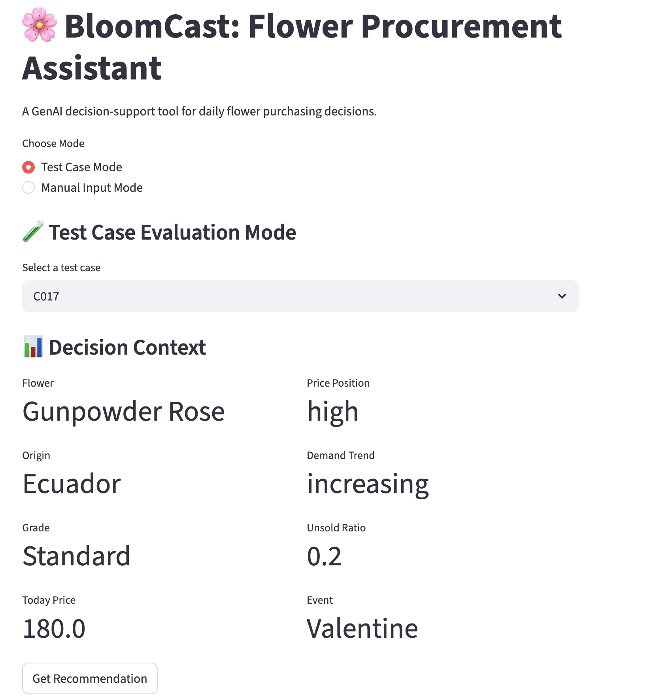
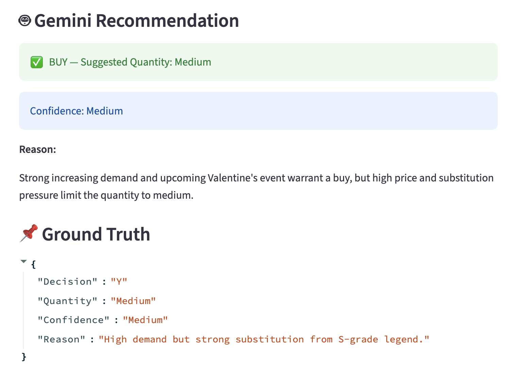

🌸 BloomCast: GenAI Flower Procurement Assistant

## 1. Project Overview

BloomCast is a GenAI-powered decision assistant designed to support a real-world micro-business workflow: Daily flower procurement decisions — whether to buy, and how much to buy.
Small flower retailers operate under high uncertainty. Every morning, they must decide how much inventory to purchase without knowing exact demand, while managing perishable goods and volatile pricing.
This project builds a structured decision system combining data, rules, and GenAI reasoning to simulate and improve this process.

## 2. Business Problem

In real-world flower markets, product variety is extremely high.  
Even within a single category like roses, there can be **20+ different varieties**, and across all categories, the number of tradable flower types can easily reach **hundreds of SKUs**.

Each product differs in:
- Price level (local vs imported)
- Quality grade (S, B, standard)
- Substitution relationships
- Demand patterns and seasonality

This creates a highly complex decision environment.

In practice, flower retailers must evaluate many SKUs simultaneously every day, making it:
- Difficult to process all relevant signals manually  
- Easy to overlook profitable opportunities  
- Prone to inconsistent or biased decisions  

To make the problem tractable for this project, a **representative subset of flower types** was selected and a synthetic dataset was constructed.
This project aims to simulate and address this challenge using a structured GenAI approach. This simplification allows the system to focus on decision logic,
while still capturing the key complexity of real-world operations.

## 3. Solution Design

BloomCast is a structured GenAI decision system, not a pure rule-based system and not a black-box AI.
🔷 System Architecture
User Input → Feature Engineering → Decision Engine (Gemini) → Recommendation

🔷 Step 1 — User Input (Minimal Interface)

The user only provides key business inputs:
Variety_Name
Flower_Grade
Origin
Today_Price
Current_Inventory
Sales_Past_3d
Event (optional)

**This mimics real-world morning decision conditions.**

🔷 Step 2 — Feature Engineering (System-generated)

The system automatically derives decision signals:
Price_Position (vs 7-day average)
Demand_Trend_3D
Unsold_Inventory_Ratio
Event_Demand_Multiplier
Substitution_Group & Pressure

**This transforms raw inputs into decision-ready features.**

🔷 Step 3 — Decision Engine (Gemini LLM)

The system uses Google Gemini with a structured prompt containing:
Business rules (price, demand, inventory logic)
Trade-off guidelines (e.g., demand vs substitution)

Outputs:
Decision: Buy / Do Not Buy
Quantity: High / Medium / Low / None
Confidence
Explanation

**This allows flexible reasoning instead of rigid rules.**

## 4. Dataset Construction
A synthetic dataset of 30 cases was created to simulate real market conditions.

🔷 Design principles:
Multiple flower categories (rose, lily, tulip, carnation, iris, etc.)
Multiple price tiers (local vs imported, S vs B grade)
Seasonal & event-based demand variation
Carefully constructed conflicting scenarios

🔷 Each case includes:
Market signals (price, demand, inventory)
Event context
Substitution relationships
Ground truth decisions (labelled manually)

**This dataset is used for evaluation.**

## 5. Methods Compared
Three approaches were implemented:

① Rule-based Baseline (baseline.py)
Fixed logic using if/else rules
Strong consistency
Limited flexibility

② Gemini (LLM) (llm_decision.py)
Structured prompt with business logic
Flexible reasoning
Can handle conflicting signals

③ Hybrid System (hybrid_decision.py)
LLM decision + rule-based quantity adjustments
Intended to improve stability

## 6. Evaluation
Evaluation is performed using:
python evaluate.py

Metrics:
Decision Accuracy (Buy / Not Buy)
Quantity Accuracy (High / Medium / Low)

Results
Method	          Decision Accuracy	      Quantity Accuracy
Baseline	        100%	                  63.33%
Gemini	          100%	                  66.67%
Hybrid	          100%	                  60.00%

Key Insight
GenAI improves decision quality when balancing multiple conflicting signals, especially for quantity decisions.

## 7. Edge Case Analysis
A high-conflict scenario was tested:

Strong Valentine’s Day demand
High price
High inventory risk
Strong substitution pressure

Model Output:
BUY with Medium quantity

Interpretation:
Demand supports buying
Risk factors reduce purchase size

**This demonstrates: The model can perform trade-off reasoning instead of rigid rule execution.**

## 8. Interactive App (Streamlit)
The project includes a user interface: python -m streamlit run app.py

Features:
🔹 Test Case Mode
Select predefined scenarios
Compare model vs ground truth

🔹 Manual Input Mode
Input real business conditions
Get AI recommendation instantly

## 9. Example Output (App Screenshot)
High-Conflict Scenario (C017)
This example demonstrates a realistic high-conflict procurement scenario:

Strong demand due to Valentine’s Day
High price (imported red roses)
Increasing demand trend
Substitution pressure from similar local products

### Decision Context


### Model Recommendation


Interpretation
The model recommends:
Decision: BUY
Quantity: Medium
Confidence: Medium

This reflects a balanced trade-off:
Event-driven demand justifies procurement
High price and substitution pressure limit quantity
Inventory considerations prevent overbuying

### Key Insight
Instead of applying rigid rules, the system demonstrates the ability to reason under conflicting business signals, which is critical in real-world decision-making.

## 10. Project Structure
BLOOMCAST/
│
├── data/
│   └── test_cases.csv
│
├── app.py
├── screenshot_context.png
├── screenshot_output.png
├── baseline.py
├── llm_decision.py
├── hybrid_decision.py
├── evaluate.py
├── .gitignore
└── README.md

## 11. Setup Instructions
① Install dependencies
```bash
pip install pandas streamlit google-genai
```

② Set API Key
```bash
export GEMINI_API_KEY="your-key"
```

③ Run evaluation
```bash
python evaluate.py
```

④ Run app
```bash
python -m streamlit run app.py
```

## 12. Key Contributions (Project Highlights)

Designed a realistic business decision dataset  
Built a structured GenAI decision system  
Compared rule-based vs LLM vs hybrid approaches  
Demonstrated LLM reasoning under conflicting signals  
Developed an interactive decision-support app  

## 13. Final Takeaway
This project shows that GenAI is not just about automation, but about supporting better decision-making under uncertainty.